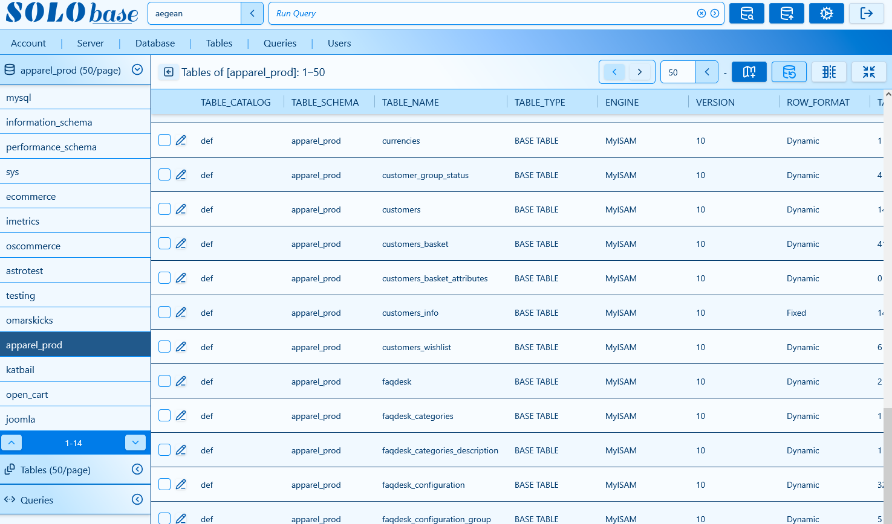
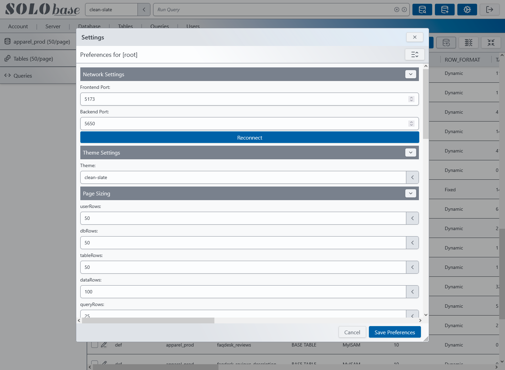
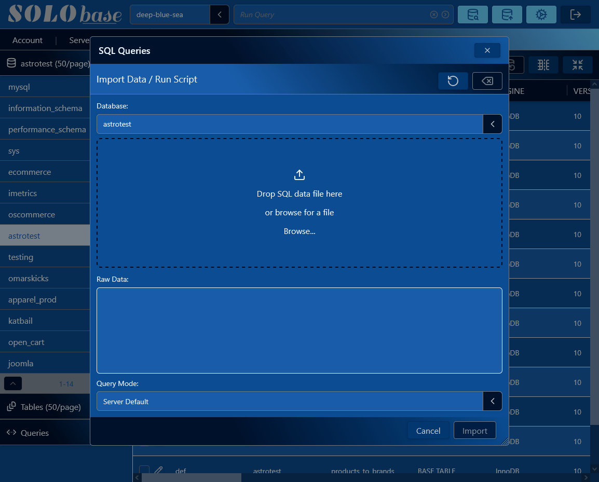
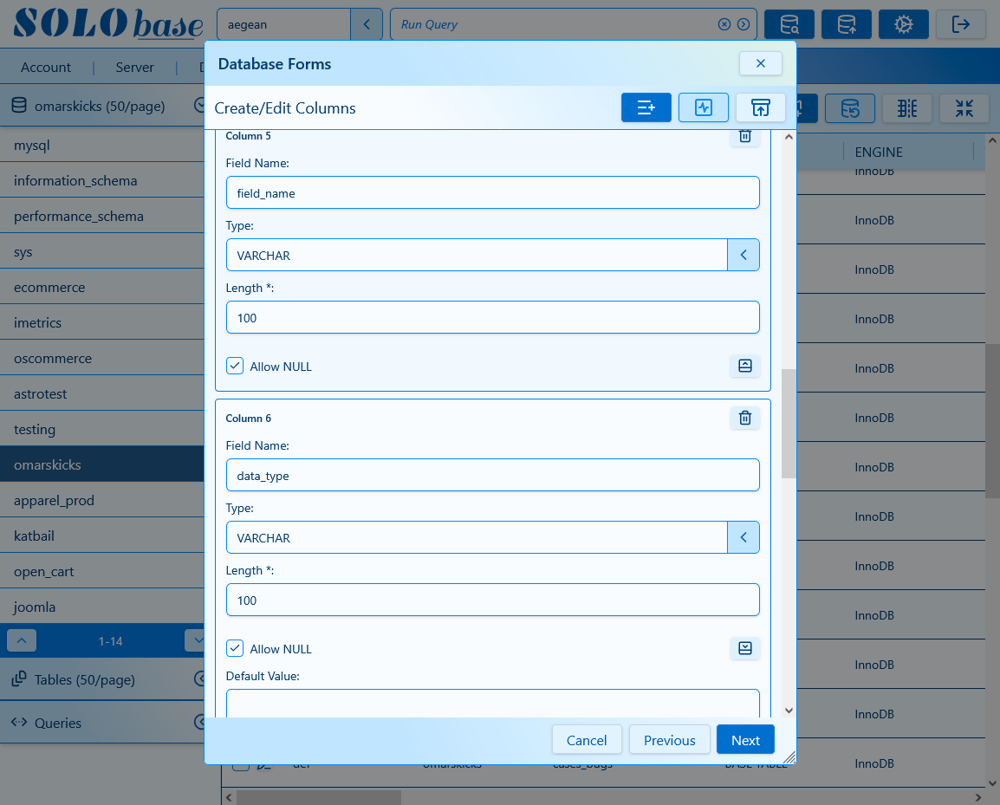

# Solobase-SPA
The Solobase-SPA offers a simple and intuitive interface for MySQL database operations, schema management, and data imports/exports. Built with ReactJS, it provides a graphical interface for managing databases, executing SQL queries, editing data, and configuring user preferences.

### Screenshots
#### Main Interface

#### Preferences

#### Importing scripts

#### Create Table Columns


### Main capabilities:
- Database browsing and navigation
- Database and table management
- Table structure inspection
- Data browsing and editing
- SQL query execution
- Query history and saved queries
- Import and export operations
- User preferences and application settings
- Database user management
- Query result inspection and management

## Support This Project
If you find this extension useful, you can support development via PayPal:
[](https://www.paypal.com/donate?hosted_button_id=CRPY96XAY793A)
Thank you for helping keep this project maintained and improving!
written by: Mark Samios [@enigma1](https://github.com/enigma1)

## Requirements (Tested on)
- Node.js >= v20
- npm >= v10
- A running [Solobase-Proxy](https://github.com/enigma1/Solobase-Proxy-Agent) or equivalent for different domains
- A running [Solobase-Server](https://github.com/enigma1/Solobase-Server) instance
- A running MySQL database instance (last test on v9.6.0 but should run on v8 also) with a MySQL user having permissions for database management operations
- A modern browser like Firefox
- The tool be deployed in secure or non-secure modes depending on the environment


## Full List of Features
### Database Navigation and Management
- Browse databases and tables
- View database metadata
- Create, modify, and delete databases
- Create and modify table structures
- Manage table columns
- Add, remove, and modify indexes

### Data Editing
- Browse table data
- Create, update, and delete rows
- Copy and paste rows between operations
- Paste default values when creating databases, tables, and rows
- Use field-specific editors depending on data type:
  - Numeric fields
  - Text fields
  - Text areas
  - JSON data
  - ENUM and SET values

### JSON Data Editor
- Integrated JSON editor for structured data
- Edit and validate JSON values directly inside the interface
- Supports JSON-based database fields

### SQL Query Execution
- Execute single SQL statements
- Execute multiline SQL scripts
- Run arbitrary SQL queries
- View query results
- Abort long-running operations

### Database Compatibility
- Legacy mode support for older MySQL structures
- Adapt database operations depending on server capabilities

### Import and Export
- Import SQL data
- Export database objects and data
- Manage large data operations through the interface

### User Experience
- Graphical database administration interface
- Context-aware controls based on database field types
- Custom editors for complex data structures
- Persistent user preferences
- Query history and saved operations


## Architecture
Solobase-SPA is the frontend application of the Solobase platform.

- ReactJS single-page application
- Communicates with the Solobase backend API
- Provides the graphical interface for database operations
- Handles client-side state management and user interaction

#### Typical deployment
**Solobase-SPA** -> Optional Local Proxy -> Solobase-Server

#### Environment
- Tested on node v20-22
- Tested on npm v10-11
- Tested with MySQL 9.6.0

#### Installation
git clone <Solobase-SPA>
cd <Solobase-SPA> folder
npm i

#### Configuration
**Solobase-SPA** is configured through the `index.html` file. You can modify the default values to suit you needs. These option appear under the APP_CONFIG object.

##### User Preferences
Switch for color scheme is called `theme`.

```json
theme: 'clean-slate'
```

Several themes are bundled in the front end

```js
export const themes = [
  'aegean',
  'arctic',
  'black-pearl',
  'clean-slate',
  'deep-blue-sea',
  'frozen-forest',
  'garden',
  'cherry-blossom',
  'lime',
  'medley',
  'mint',
  'neon-lights',
  'pastel',
  'sandstorm',
  'slacken',
  'sunset-vibes',
];
```

Configure the front and back ports used by **Solobase-SPA**.

```json
backPort: 5650
frontPort: 5173
```
Notice there is no domain to specify as the front end needs to match the back-end domain. Only ports can be configured. If you are using this front end on your local machine you may want to install the solobase-proxy for communication with a remote solobase-server.

You can connect in SSL or NON-SSL modes point the browser to the domain of you your choice and make sure the backed uses the same domain.

To create certificates for the back-end...
```batch
openssl req -x509 -newkey rsa:4096 -nodes \
  -keyout server.key \
  -out server.crt \
  -days 1825
```

Configure the following variables:
```batch
TLS_KEY=/path/to/server.key
TLS_CERT=/path/to/server.crt
```

#### Operation
For *development* use
```
npm run dev
```
otherwise for *production*
```
npm run build
npm run preview
```
Output files will be generated under the *dist* folder


##### External Frontend Deployment
If the Solobase frontend SPA is deployed separately from **Solobase-Server** (for example, hosted on another machine or served from a different origin), an additional proxy component can be used to handle the frontend-to-server connection. See the following repositories for details.

The optional proxy component is available here:
https://github.com/enigma1/Solobase-Proxy-Agent

The Solobase Server is located here:
https://github.com/enigma1/Solobase-Server

When the frontend and **Solobase-Server** are deployed together on the same host and origin, the proxy is not required.

## 🧾 License
GNU General Public License (GPL) v3
